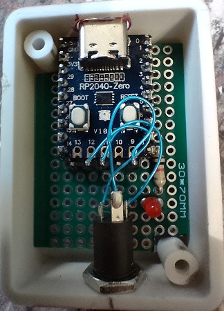
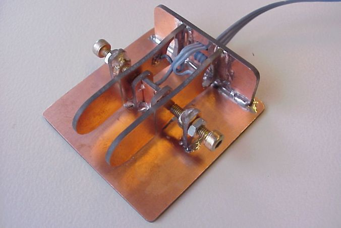
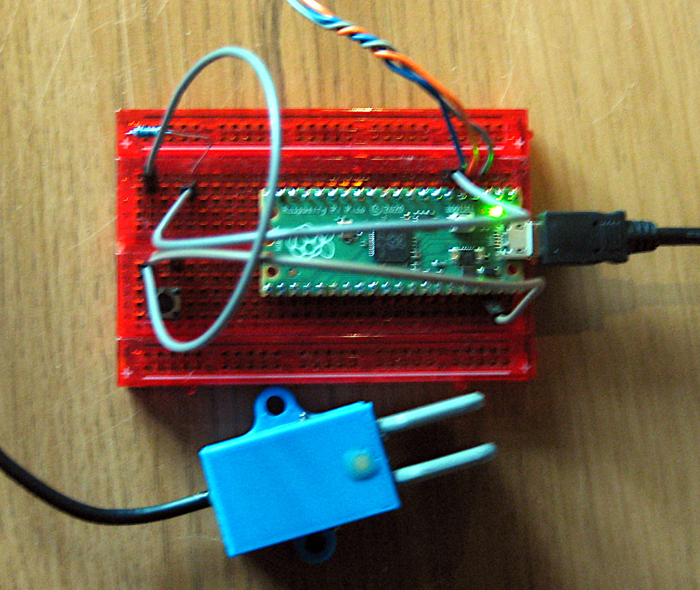
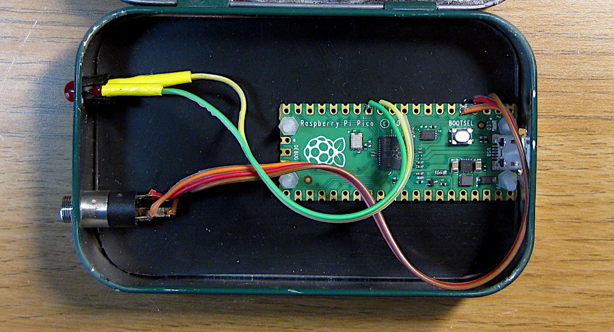
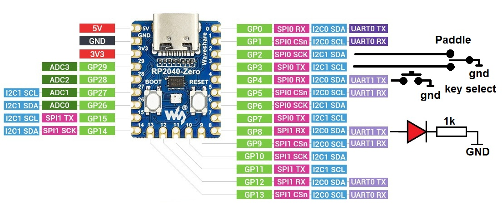
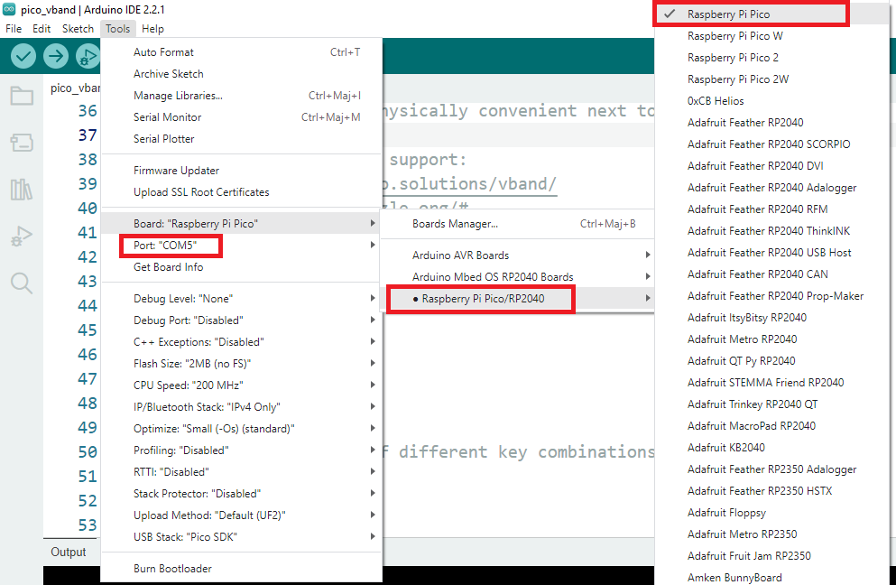
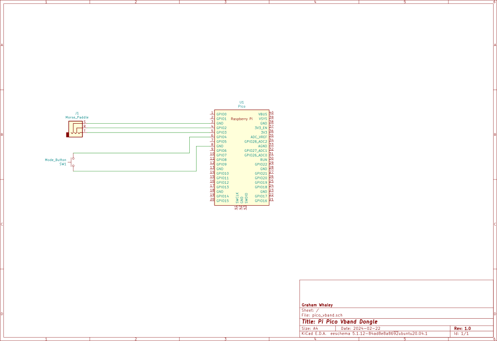

# A Pi Pico based vband CW/Morse USB 'dongle'



This repository contains the code and instructions to build a USB dongle
that allows a morse key or paddle to be conected to your computer like a
USB keyboard, which then allows you to interact with web sites such as
[vband]( https://hamradio.solutions/vband/),
[Vail](https://vail.woozle.org/#) and 
[morsecode.me](https://morsecode.me/#/help/practice).


## [PC-board iambic CW paddle](https://pa0cmu.nl/paddle.html)



## Prototype:



## Built, minus mode button but with external LED:



## F4GOH changes

Use Pi [Pico zero](https://fr.aliexpress.com/item/1005007650325892.html) , So led is on GPIO 8



## How to compile

Add this Json file in Arduino preferences

```console
https://github.com/earlephilhower/arduino-pico/releases/download/global/package_rp2040_index.json
```



## Or just copy pico_vband.ino.uf2 in RPI-PICo zero folder

pico_vband.ino.uf2 is in bulid directory

## Inspiration

I have a regular practice HF CW QSO with a friend of mine, but he lives about
35 miles away, the other side of a range of hills. This means quite often, conditions
depending, we cannot get the HF NVIS to play ball, and thus cannot make an on air QSO.

Thus, at times we may wish to revert to an 'online' QSO. There are a few websites that enable
that, such as:

  -  [vband]( https://hamradio.solutions/vband/),
  -  [Vail](https://vail.woozle.org/#)
  -  [morsecode.me](https://morsecode.me/#/help/practice).

You can 'send' on those sites using your keyboard, but it's much nicer to be able to use your
morse key or paddle. To do this you require a 'dongle' that translates from your key into a
USB HID device - aka, looks like a keyboard.

There are a number of projects that already exist to do this, ranging from the very simple using
Aruduino-like micro controllers with anything from an Attiny to a SAMD21 processor. Here are some
samples I took inspiration from:

  - [sipsmi vband_dongle](https://github.com/sipsmi/vband_dongle/tree/main)
  - [MorsePaddle2USB](https://github.com/mgiugliano/MorsePaddle2USB)
  - [nealey vail-adapter](https://github.com/nealey/vail-adapter)

I wanted to use a Pi Pico, as I had a number laying around doing nothing, and they are very very
cheap. I also wanted to code this up in Arduino IDE C, as that is a common development environment,
and I'm not really a Python guy (another common development system for the Pi Pico). If you want to
go with a Python implementation, there are some details on
[KG5QNO's QRZ page](https://www.qrz.com/db/KG5QNO).

## Features

The dongle implements a number of features:

  - Supports single (straight) and dual (paddle) inputs
  - Supports various key output modes to be compatible with multiple sites
  - Mode changes through a single push button
  - Activity feedback via an LED

## Usage

Pretty much, plug your key or paddle into the dongle, plug your dongle into your computer,
go to the web site you wish to use, and see if it recognises the keystrokes. If the site does
not recognise the keystrokes you may need to press the 'mode' button to move to a mode that
matches the site. The following tables show which mode generates which keystrokes.

| Mode | Keys       | Notes |
| ------- | ---------- | ------- |
| 1    | '[' ']' | Primarily vband, also Vail |
| 2    | 'x' 'z' | Vail |
| 3    | 'e' 'i' | morsecode.me |
| 4    | 'CTRL-L' 'CTRL-R' | vband and Vail |

It should be noted that mode 4 may be particularly useful, as the 'CTRL' keys may be detected by
some websites even when the window does not have 'focus'.

For precise details on which site supports which input characters, please refer to the specific
websites.

The mode key has the following functions:

| Action | Result |
| ------- | ---------- |
| Short press(es) | Cycles through the modes. New mode number flashed out on LED |
| Long press | Reset to mode 1 |

The LED has a few functions:

  - At boot it shows a 'heartbeat' until any key or button is pressed
  - It lights when either key/paddle is being pressed
  - It flashes out the mode as a number of dots after a mode change

## Building

I built the code in Arduino IDE version 1.8.13. I used the
[arduino-pico](https://arduino-pico.readthedocs.io/en/latest/) Pi Pico board support package
rather than the Arduino MBed package, as the USB HID support seemed easier to get to work.

Set the board to 'Raspberry Pi RP2040 Boards (3.7.2)/Raspberry Pi Pico'. Set the 'USB Stack' to
'Pico SDK'.

There are few couple of other library dependencies:

  - [singleLEDLibrary](https://github.com/SethSenpai/singleLEDLibrary)
  - [arduino-timer](https://github.com/contrem/arduino-timer)
  - [ClickButton](https://github.com/marcobrianza/ClickButton)

### Building for other boards

>  Note: If you don't want to build this from source, releases are not available as Pi Pico
>    uf2 files in the Releases section on the rhs of this page. See the
>    [Releases section](#releases) for more information.

There is nothing particularly specific to the Pi Pico in the code. If you port to another board
you will need to ensure it has hardware support for USB HID mode. The USB HID code is also the most
likely to need modifying, which may be as simple as changing the header files that are pulled in.

## Design/Implementation

The overall design is pretty simple. In the main loop, read the morse key/paddle inputs,
and send the appropriate
characters over the USB HID keyboard interface. Also read the mode button to see if we need to
swap modes. Flash the LED when necessary. That is about it, but there are some subtleties:

Debouncing. This is probably the most subtle item. We debounce the morse inputs to try and not send
a stream of up/down key presses when really we only want one. Most debounce algorithms use some sort
of delay (be that a timer or a stream of reads) to assess when the input has settled down before
registering the event. I didn't want to do that, as I wanted to register the morse press as fast
as I could so as to remove any perceivable lag or delay. Thus, what we do to debounce is register the
key up as soon as we see a state change, but then ignore all other changes for a set debounce period.
Currently the debounce period is set to 10mS. That seems to be fairly standard-ish for how long it
takes a button to settle. Given a fast morse code 'dit' may get down to about 30mS, the 10mS delay
should not interfere with us registering strokes.

The other interesting tiny bit of code is the handling of the LED. Sadly the library I chose does not
have 'one shot' functions, so once you kick off a flash for instance then it will continue until you
cancel it. That's not always useful. Thus, I use the timer library to set a timer to cancel the LED
event at some future calculated time. It's a bit awkward, but seems to work.

## Schematic

The schematic is not exactly difficult. You merely need to connect the connections for the
morse key/paddle and the mode switch. If you require an external LED then, for reference I connected
mine between pins 12 (GPIO9) and 13 (GND), and changed the define of `LED_PIN` near the top of the
`.ino` file from `LED_BUILTIN` to `8`. 



## Notes about 'straight key' mode

In case it helps somebody down the line, we should briefly discuss 'straight key mode'. As far as
the dongle knows, there is no such thing. It will be in normal 'twin paddle' mode, but the straight
key will only be connected to one of the paddles. Generally (possibly depending on the target
website) it should not matter which paddle pin the key is connected to.

When you depress your straight key for a 'dit' or a 'dah', the dongle does not know or try to determine
if you are trying to send a 'dit' or a 'dah'. All it does is send the up and down keystrokes and the
website software determines if you sent a 'dit' or 'dah', depending on how long you held the key down.

You may have to tell whichever website or software you are using with the dongle that you are operating
in straight key mode, otherwise it may default to presuming you are using a paddle.

## Releases

To make life a little easier for those who are not au-fait with installing and building Arduino
projects, releases are now made and placed in the [Releases area](https://github.com/grahamwhaley/pico_vband/releases).

To use the uf2 files in the releases you [boot your Pico in USB flash drive mode and drag the uf2
file onto the drive](https://www.raspberrypi.com/documentation/microcontrollers/pico-series.html#resetting-flash-memory). This is the normal way to load a uf2 file onto a Pi Pico.

| Version | Date       | Changes |
| ------- | ---------- | ------- |
| v1.1    | 2025-06-15 | Initial release With f4goh changes|

## Future work

There are some features I might add in the future. I've added them to the [ToDo](TODO.md) file.
